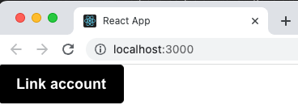
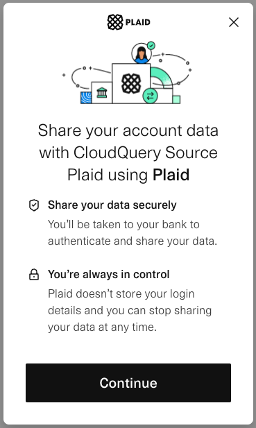
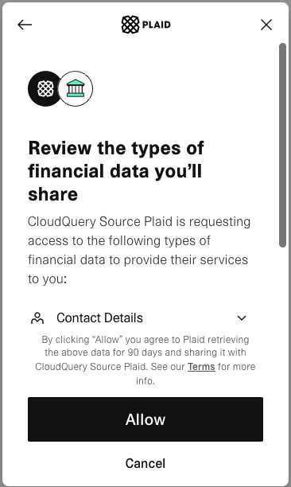
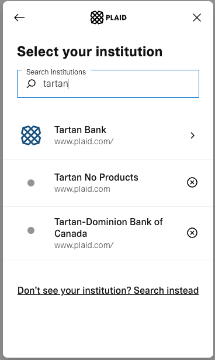
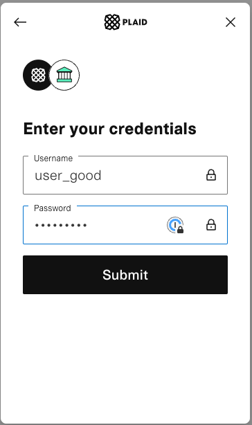
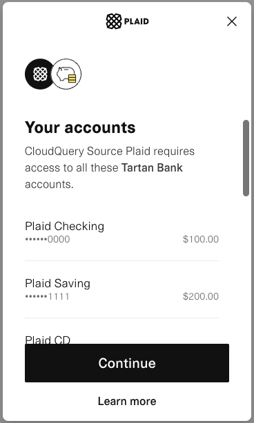
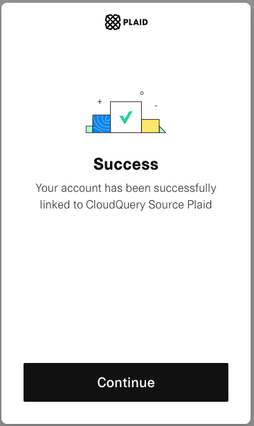
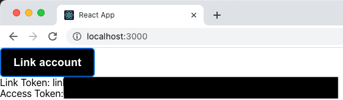

# Plaid Access Token Generator

## Prerequisites

- [Node.js](https://nodejs.org/en/download/) (v18.0.0 or higher)
- [Plaid client id and secret](https://dashboard.plaid.com/team/keys)

## Setup

Create a `.env` file in the root of the project and add the following environment variables:

```ini
PLAID_CLIENT_ID=<plaid-client-id>
PLAID_SECRET=<plaid-secret>
# Should match the Plaid secret you are using. Can be one of: development, sandbox, or production. Defaults to sandbox.
PLAID_ENV=<plaid-environment>
```

> See [the Plaid docs](https://plaid.com/docs/api/#api-host) for more information about environments

Install dependencies:

```bash
npm ci
```

## Usage

Start the server and client application:

```bash
npm run start
```

That should open a browser window to `http://localhost:3000`. If not, navigate to that URL.

### Step 1 - Click the `Link Account` button

[](./images/link-account.png)

### Step 2 - Click Continue

[](./images/consent.png)

### Step 3 - Click Allow

[](./images/review.png)

### Step 4 - Select an Institution

[](./images/select-institution.png)

For testing purposes you can use the Plaid provided sandbox institution: `Tartan Bank`

### Step 5 - Enter your credentials

[](./images/enter-credentials.png)

For sandbox institutions, use the following credentials:

- Username: `user_good`
- Password: `pass_good`

> See more [sandbox institutions here](https://plaid.com/docs/sandbox/institutions/)

### Step 6 - Verify Accounts Access and Continue

[](./images/verify-accounts.png)

### Step 7 - Verify Successful Link and Continue

[](./images/success.png)

### Step 8 - Copy the access token

[](./images/access-token.png)